

  

  
  
  
  
  
   
  
  
  
  
  
  
  

 

  <a href="https://muvekkilbilgi.com"></a>

> **[muvekkilbilgi.com](https://muvekkilbilgi.com)** — İnsanların hukuki haklarını öğrenip tazminatlarını birkaç saniyede hesaplayabildiği platform.
> Trafik kazası, değer kaybı ve işçilik alacağı **hesaplama motorları** · vergi tebligatı, gümrük, SGK, emlak ve müteahhit konularında **adım adım risk analizi** ve PDF rapor · **yapay zekâ destekli sohbet** · **2FA korumalı yönetim paneli** ve kural motoru.

 


> **Geçit Hukuk Bürosu** — 24 sayfalık, hiçbir bağımlılığı olmayan kurumsal site. On çalışma alanı, avukat kadrosu, makaleler, KVKK, sık sorulan sorular ve randevu akışı. Masaüstü ve mobil uyumlu.

 

<table>
<tr>
<td width="50%" valign="top">
 
<b>BAHHSAF</b> — Video prodüksiyon ve web tasarım ajansı sitesi. Hizmetler, çekimden yayına süreç, örnek işler ve kafeler ile yerel işletmeler için hazır paketler.
</td>
<td width="50%" valign="top">
 
<b>Müvekkil Bilgi büro paneli</b> — Müvekkil ve dosya takibi, yasal süre uyarıları ve anlık bildirimler. Veriler Supabase'de satır bazlı güvenlikle (RLS) avukat başına ayrılıyor. Yönetim paneline giriş iki adımlı doğrulamayla (TOTP) yapılıyor.
</td>
</tr>
</table>

 



 

<table>
<tr>
<td width="50%" valign="top">
Adana'da bir mahallede geçen açık dünya oyunu. Tefeciye borçlu bir gencin mafya hikâyesi, bölüm seçimi, üç zorluk seviyesi ve oyunun içinden dünyayı düzenleyen bir editör var. Masaüstü ve Android için paketleniyor.
</td>
<td width="50%" valign="top">
Kendi motorum Geçit Engine üzerinde, Forward+ renderer ile çok oyunculu birinci şahıs nişancı oyunu. Önce <b>TAHLİYE</b> adında Türkçe bir extraction shooter olarak başladı. Hedef platform Steam.
</td>
</tr>
<tr>
<td width="50%" valign="top">
Tarayıcıda, kurulum gerektirmeden oynanan PSX tarzı korku oyunu. Eski PlayStation hissi veren düşük çözünürlüklü özel bir render hattı kullanıyor.
</td>
<td width="50%" valign="top">
<i>Anomaly President</i> oyununa 8 kişilik çevrimiçi oynanış ekleyen mod. Steam P2P üzerinden host-otoriteli ağ yapısı ve tek tıkla kurulum programı var.
</td>
</tr>
</table>

 


<table>
<tr>
<td width="50%" valign="top">
Godot 4.3 üzerine kurulu, bağımsız oyunlara yönelik hafif oyun motoru. Kaynaktan derleniyor. GLES3 shader hatalarını düzelttim, kendi teması ve markası var.
</td>
<td width="50%" valign="top">
Tarayıcıda çalışan kurgu programı: 16 kamera hareketi, 26 geçiş, anahtar kareler, ritim analizi, 3B logo ve Whisper ile otomatik Türkçe altyazı.
</td>
</tr>
<tr>
<td width="50%" valign="top">
Ham kliplerden müziğin vuruşlarına oturan dikey editler üretiyor: hız rampası, zoom punch, whip pan, glitch ve gece renk ayarı.
</td>
<td width="50%" valign="top">
Oyun oynarken ekrandaki yazıları anında Türkçeye çeviren küçük bir baloncuk. Oyun dosyalarına dokunmadığı için GTA 5 Online'da da çalışıyor.
</td>
</tr>
<tr>
<td width="50%" valign="top">
GameMaker oyunları için komut satırı aracı: <code>data.win</code> dosyasını çözümlüyor, eşya, görev ve diyalogları listeliyor, kayıt dosyasını düzenliyor.
</td>
<td width="50%" valign="top">
Yönetim paneline giriş için doğrulama kodu üreten uygulama (RFC 6238). Android ve Windows sürümü var, internet bağlantısı gerektirmiyor.
</td>
</tr>
</table>

 

