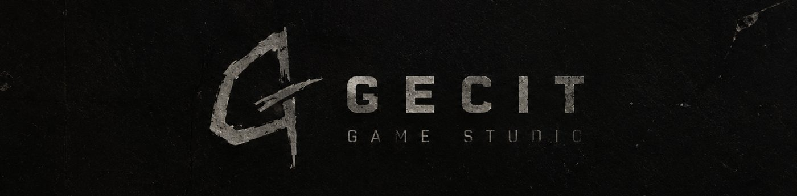
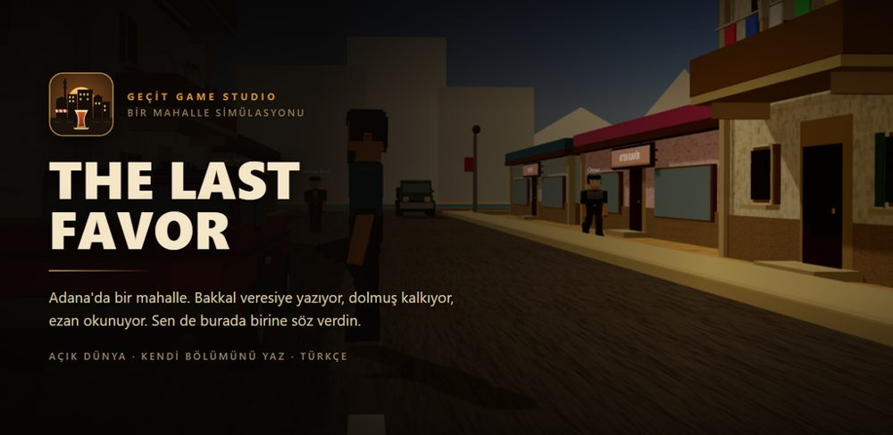
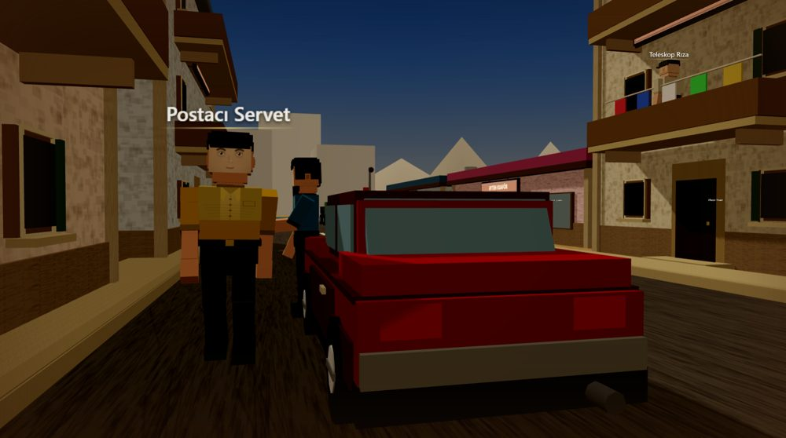
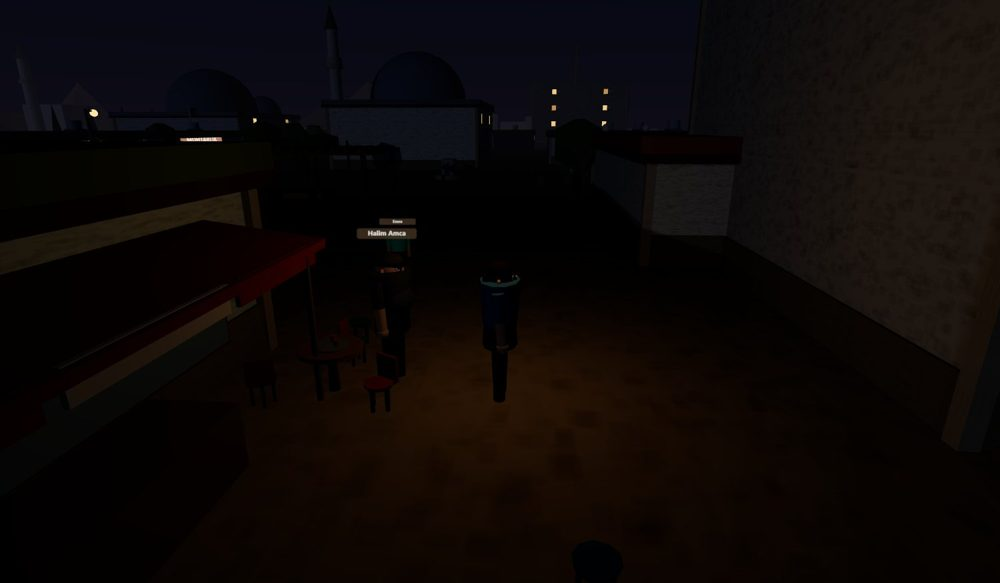
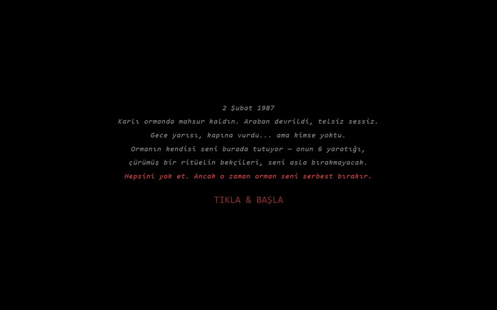
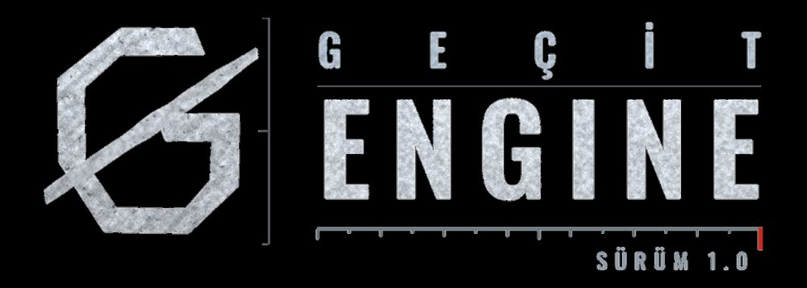
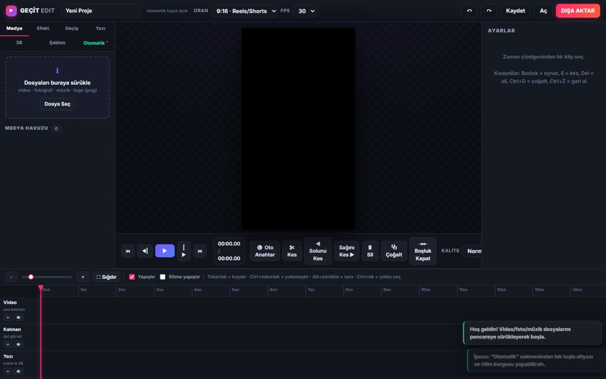
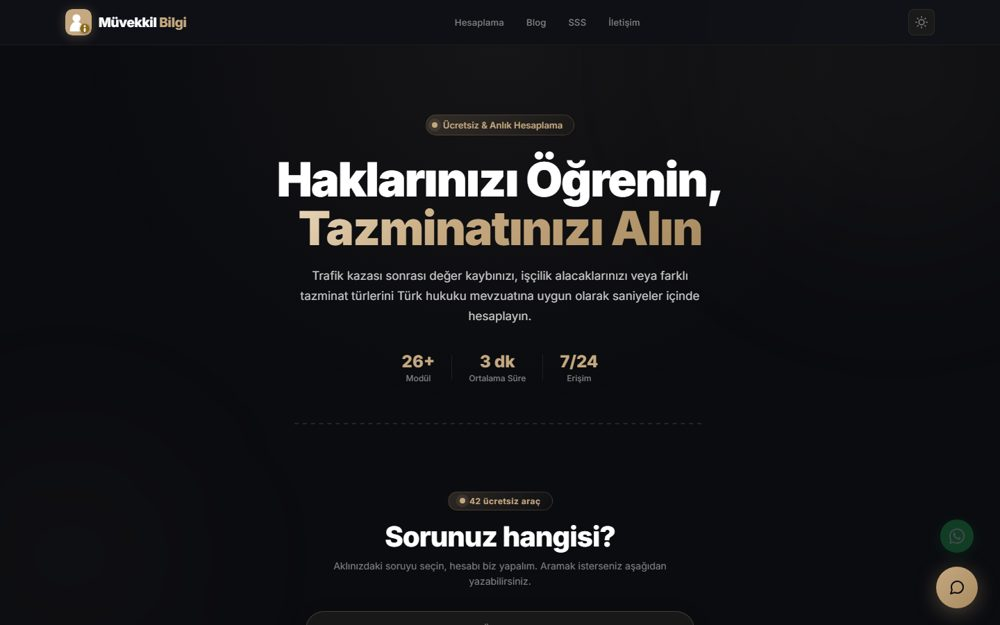
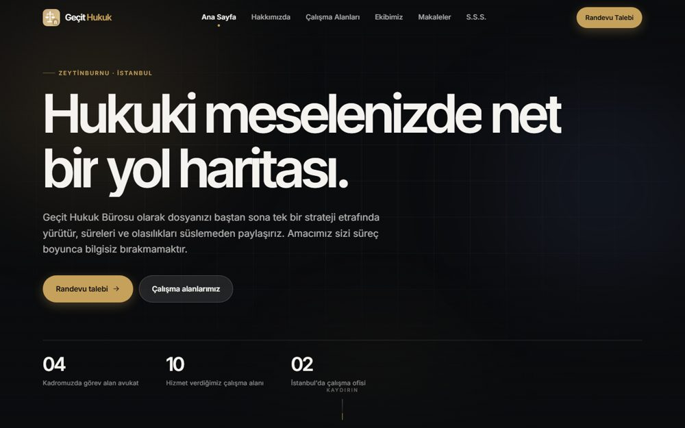
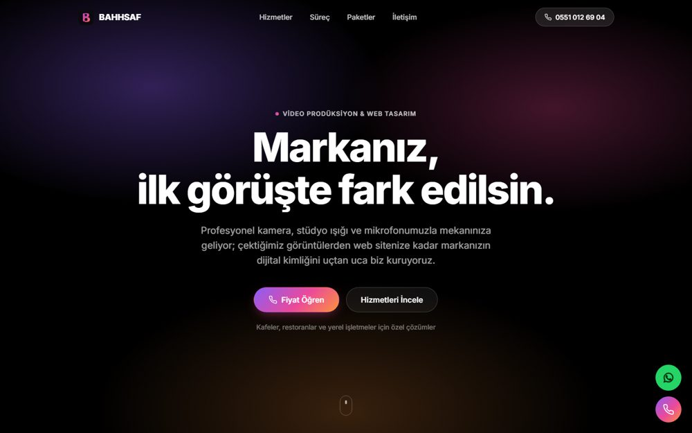

  

<h1 align="center">Ahmet Sait Geçit</h1>

  <b>Oyun geliştirici · Geçit Game Studio</b> 
  Oyunlar, oyun motoru, video kurgu araçları ve hukuk teknolojisi üzerine çalışıyorum.

  
  
  
  
  
  
  
  
  
  
  

  <a href="#-oyunlar">Oyunlar</a> ·
  <a href="#%EF%B8%8F-oyun-motoru-ve-modlama">Motor ve modlama</a> ·
  <a href="#-video-araçları">Video araçları</a> ·
  <a href="#-web-ve-hukuk-teknolojisi">Web</a> ·
  <a href="#-masaüstü-ve-mobil-araçlar">Masaüstü ve mobil</a>

---

## 🎮 Oyunlar

<table>
<tr>
<td width="50%" valign="top">
 
<h3>THE LAST FAVOR (PAYDUŞ)</h3>
Adana'da bir mahallede geçen açık dünya mahalle simülasyonu. Tefeciye borçlu bir gencin mafya hikâyesi, bölüm seçimi, üç zorluk seviyesi ve oyunun içinden dünyayı düzenlemeye yarayan bir editör var. Masaüstü ve Android için paketleniyor, Google Play yayını hazırlanıyor.  
<code>three.js</code> <code>Electron</code> <code>Android</code>
</td>
<td width="50%" valign="top">
 

</td>
</tr>
<tr>
<td width="50%" valign="top">
<h3>COLD ZONE</h3>
Kendi oyun motorum Geçit Engine üzerinde, Forward+ renderer ile yapılan çok oyunculu birinci şahıs nişancı oyunu. Önce <b>TAHLİYE</b> adında Türkçe bir extraction shooter olarak başladı. PBR kaplamalar, rigli karakterler ve animasyon kütüphanesi kullanıyor. Hedef platform Steam.  
<code>Geçit Engine</code> <code>GDScript</code> <code>Multiplayer</code>
</td>
<td width="50%" valign="top">
 
<h3>KORKU ORMANI</h3>
Tarayıcıda çalışan, PSX tarzı retro 3B korku oyunu. Düşük çözünürlüklü, eski PlayStation hissi veren özel bir render hattı kullanıyor.  
<code>three.js</code> <code>JavaScript</code> <code>WebGL</code>
</td>
</tr>
</table>

## ⚙️ Oyun motoru ve modlama

<table>
<tr>
<td width="50%" valign="top">
 
<h3>Geçit Engine</h3>
Godot 4.3 üzerine kurulu, bağımsız oyunlara ve PSX korku ile simülasyon türlerine yönelik hafif bir oyun motoru. Editör ve dışa aktarma şablonları kaynaktan derleniyor. GLES3 tarafında shader hatalarını düzelttim, kendi arayüz teması ve markası var.  
<code>C++</code> <code>SCons</code> <code>OpenGL / Vulkan</code>
</td>
<td width="50%" valign="top">
<h3>AnomalyOnline</h3>
Steam'deki <i>Anomaly President</i> oyununa 8 kişilik çevrimiçi oynanış ekleyen mod. Steam P2P üzerinden, sunucunun hakem olduğu (host-otoriteli) bir ağ yapısı kullanıyor. Horde, PvP ve serbest dolaşım modları planlandı. Kolay kurulum için bir kurulum programı da var.  
<code>C#</code> <code>BepInEx 6</code> <code>IL2CPP</code> <code>Steamworks</code>
  
<h3>Zümrüt Motoru</h3>
GameMaker oyunları için komut satırından çalışan kayıt ve mod aracı. <code>data.win</code> dosyasını okuyor. Eşya, görev ve diyalog tablolarını listeliyor, kayıt dosyasını düzenliyor ve mod yüklüyor.  
<code>Python</code> <code>PyInstaller</code>
</td>
</tr>
</table>

## 🎬 Video araçları

<table>
<tr>
<td width="50%" valign="top">
 
<h3>Geçit Edit</h3>
Reels, Shorts ve TikTok için tarayıcıda çalışan video kurgu programı. WebGL2 ile görüntü işliyor, WebCodecs ile MP4 dışa aktarıyor. Özellikleri:
<ul>
<li>16 kamera hareketi, 26 geçiş, 12 look, 12 renk düzenleme ayarı</li>
<li>Anahtar kare (keyframe) sistemi ve müziğin ritmini algılama</li>
<li>3B logo katmanı ve hazır şablonlar</li>
<li>Whisper ile otomatik Türkçe altyazı</li>
</ul>
Kurulum gerektirmiyor.  
<code>WebGL2</code> <code>WebCodecs</code> <code>Whisper</code> <code>Node.js</code>
</td>
<td width="50%" valign="top">
<h3>Araba Edit</h3>
Ham araba kliplerinden müziğin ritmine oturan dikey (1080×1920) edit videoları üreten araç. After Effects'te elle yapılan işleri otomatik yapıyor: vuruşta kesme, hız rampası, zoom punch, tekerleğe veya fara yaklaşan geçişler, whip pan, glitch, gece renk ayarı ve bloom.  
<code>Python</code> <code>FFmpeg</code>
</td>
</tr>
</table>

## 🌐 Web ve hukuk teknolojisi

<table>
<tr>
<td width="50%" valign="top">
 
<h3><a href="https://muvekkilbilgi.com">muvekkilbilgi.com</a></h3>
İnsanların hukuki haklarını öğrenip tazminatlarını hesaplayabildiği site. Sunduklarım:
<ul>
<li>Trafik kazası, değer kaybı ve işçilik alacağı hesaplayıcıları</li>
<li>Vergi tebligatı, gümrük, SGK gibi konular için adım adım risk analizi araçları ve PDF rapor</li>
<li>Yapay zekâ destekli sohbet</li>
<li>İki adımlı doğrulamalı (2FA) yönetim paneli</li>
</ul>
<code>Node.js</code> <code>Netlify Functions</code> <code>Supabase</code>
</td>
<td width="50%" valign="top">
 
<h3>Geçit Hukuk kurumsal sitesi</h3>
Bir hukuk bürosunun kurumsal sitesi: 24 sayfa, statik, hiçbir bağımlılığı yok. Çalışma alanları, ekip, makaleler, KVKK ve randevu sayfaları var.  
<code>HTML</code> <code>CSS</code> <code>JavaScript</code>
</td>
</tr>
<tr>
<td width="50%" valign="top">
 
<h3>BAHHSAF</h3>
Video prodüksiyon ve web tasarım ajansı için tanıtım sitesi. Kafeler ve yerel işletmeler için hazır paketler sunuyor.  
<code>HTML</code> <code>CSS</code> <code>JavaScript</code>
</td>
<td width="50%" valign="top">
<h3>Müvekkil Bilgi büro paneli</h3>
Hukuk bürosunun kendi içinde kullandığı panel: müvekkil ve dosya takibi, yasal süre uyarıları, anlık bildirimler. Veriler satır bazlı güvenlikle (RLS) avukat başına ayrılıyor.  
<code>TypeScript</code> <code>Vite</code> <code>Supabase</code> <code>Edge Functions</code>
</td>
</tr>
</table>

## 🧰 Masaüstü ve mobil araçlar

<table>
<tr>
<td width="50%" valign="top">
<h3>ÇeviriHUD</h3>
Oyun oynarken ekrandaki yazıları anında Türkçeye çeviren küçük bir baloncuk. Oyun dosyalarına dokunmuyor, bu yüzden Türkçe yamanın çalışmadığı GTA 5 Online'da da kullanılabiliyor. Windows'un kendi OCR'ını kullanıyor, ekran üzerinde tıklamaları engellemeden duruyor ve kısayol tuşlarıyla yönetiliyor.  
<code>Python</code> <code>PySide6</code> <code>Windows OCR</code>
</td>
<td width="50%" valign="top">
<h3>Müvekkil Bilgi Doğrulayıcı</h3>
Yönetim paneline giriş için iki adımlı doğrulama kodu üreten uygulama (RFC 6238 TOTP). Android ve Windows sürümü var, internet bağlantısı gerektirmiyor.  
<code>Java (Android)</code> <code>Python</code>
</td>
</tr>
</table>

---

  Projelerin kaynak kodları gizli depolarda tutuluyor. İş birliği veya demo için bana GitHub üzerinden ulaşabilirsiniz.

